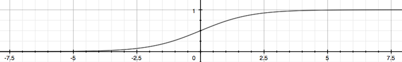

# Machine Learning Week 3

## Classification and Representation

Now we are switching from regression problems to **classification problems.** Don't be confused by the name "Logistic Regression"; it is named that way for historical reasons and is actually an approach to classification problems, not regression problems.

### Binary Classification

Instead of our output vector y being a continuous range of values, it will only be 0 or 1.

$y\in\{0,1\}$

Where 0 is usually taken as the "negative class" and 1 as the "positive class", but you are free to assign any representation to it.

One method is to use linear regression and map all predictions greater than 0.5 as a 1 and all less than 0.5 as a 0. This method doesn't work well because classification is not actually a linear function.

Our hypothesis should satisfy:

$0\le h_\theta(x) \le 1$

Our new form uses the "Sigmoid Function", also called the "Logistic Function":

$h_\theta(x) = g(\theta^Tx)$

$z = \theta$

$g(z) = \frac{1}{1+e^{-z}}$

The function g(z), shown here, maps any real number to the (0, 1) interval, making it useful for transforming an arbitrary-valued function into a function better suited for classification.

Then $h\theta(x)$ will give us the **probability** that our output is 1. For example, $h\theta(x) = 0.7$ gives us the probability of 70% that our output is 1.

$h\theta(x) = P(y=1|x;\theta) = 1-P(y=0|x;\theta)$

$P(y=0|x;\theta)+P(y=1|x;\theta) = 1$

### Decision Boundary

In order to get our discrete 0 or 1 classification, we can translate the output of the hypothesis function as follows:

$h_\theta(x) \ge 0.5 \rightarrow y=1$

$h_\theta(x) < 0.5 \rightarrow y=0$

The way our logistic function g behaves is that when its input is greater than or equal to zero, its output is greater than or equal to 0.5:

$g(z) \ge 0.5 \\ when \ z \ge 0$

So if pur input to g is $\theta^TX$, then that means:

$h_\theta(x) = g(\theta^Tx)\ge0.5 \\
when \ \theta^Tx \ge 0$

From these statements we can now say:

$\theta^Tx \ge 0 \rightarrow y=1 \\
\theta^Tx < 0 \rightarrow y=0$

The decision boundary is the line that separates the area where y = 0 and where y = 1. It is created by our hypothesis function.
